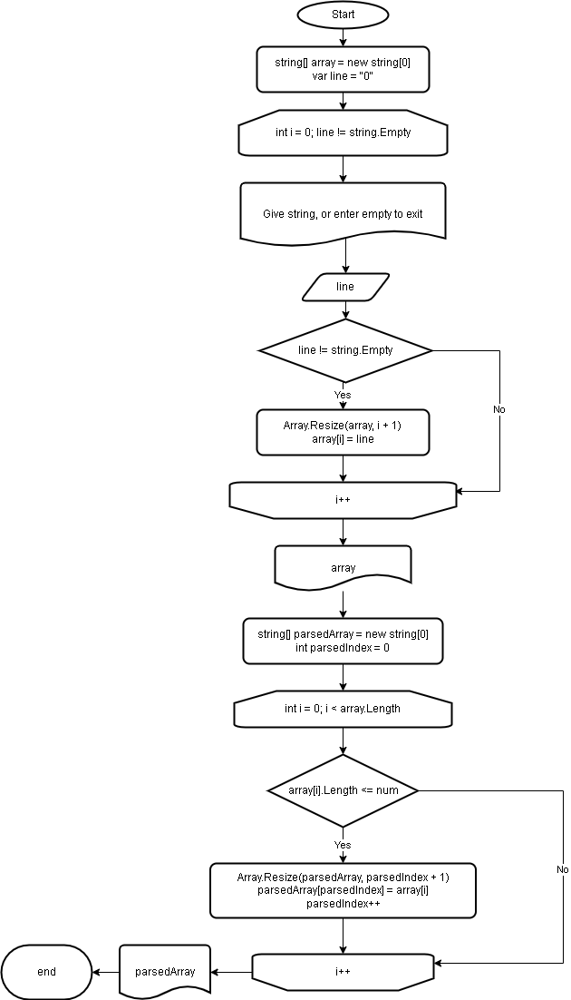

# GeekBrains task
## Intro
This repo contains specialists test organized by GeekBrains company.
Main goal is to code program that generates strings array or ask user to enter strings to fill arrays elements. Major part of program should search inside that array only elements that contains strings equal or less then 3 symbols. Output of the program must be:
["12345", "lkkuuhh", "cat", "hi", "Russia"] -> ["cat", "hi"]
 
## Task
Here is link to task in [Russian](test.jpg), it consists 5 parts:
1. To create GitHub repo
2. To make algorithm drawing for future program
3. To write formatted README.md with descriptions
4. To code program based on algorithm from part 2
5. To use version control system, so more than 4 commits will be presented

## GitHub
Repo with task named “speciality” and resides here https://github.com/allseenn/speciality.git
## Algorithm
Algorithm direct link in drawio format https://github.com/allseenn/speciality/blob/main/test.drawio

## README
Formatted with Markdown language has direct https://github.com/allseenn/speciality/blob/main/README.md
## Program
Source code on C# here https://github.com/allseenn/speciality/blob/main/test/Program.cs
## Version control
There is more than dozen commits https://github.com/allseenn/speciality/commits/main

